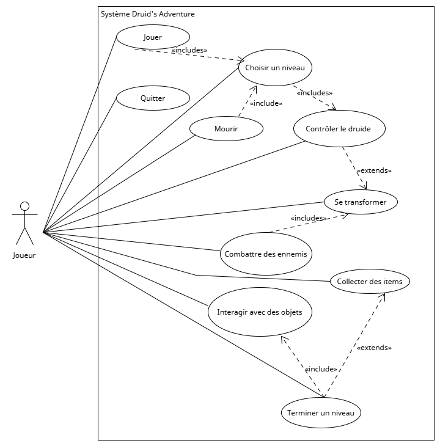

# Introduction

## Contexte du projet

Dans le cadre de mon Travail Pratique Individuel (TPI), j’ai développé un jeu vidéo de type platformer 2D intitulé **Druid’s Adventure**.

Ce projet s’inscrit dans un cadre pédagogique visant à valider mes compétences en développement, notamment en programmation C# avec le moteur Unity, ainsi qu’en gestion de projet, planification et rédaction de documentation technique.

L’objectif principal est de concevoir une application interactive intégrant plusieurs mécaniques de jeu, tout en respectant les exigences du cahier des charges défini par mon formateur, M. Aliprandi, et validé par les experts, M. Ferri et M. Murisier.

Ce projet présente plusieurs enjeux techniques et organisationnels :

- La mise en œuvre d’un système de gameplay dynamique basé sur la transformation du personnage.
- La gestion de ressources, notamment les points de vie et le mana.
- La conception d’une architecture logicielle claire, structurée et maintenable.
- La production d’une documentation conforme aux exigences du TPI.

Le jeu comprend les fonctionnalités principales suivantes :

- Un personnage principal, le druide, capable de se transformer en plusieurs animaux.
- Un système de gestion des points de vie et du mana.
- Plusieurs ennemis, obstacles et objets interactifs.
- Différents écrans : menu principal, sélection de niveau, écran de jeu et écran de fin.
- Un système de sauvegarde des données, notamment les points de vie et le mana.

## Objectifs du TPI

Le principal objectif de ce projet est de démontrer mes compétences en développement C# et en gestion de projet informatique à travers la réalisation d’un jeu fonctionnel respectant les contraintes définies dans le cahier des charges.

Pour atteindre cet objectif, plusieurs sous-objectifs ont été définis.

### Objectifs techniques

- Implémenter un système de transformation du personnage, permettant de passer du druide à différentes formes animales.
- Adapter la physique et le comportement du personnage en fonction de sa transformation et de son environnement.
- Mettre en place un système de gestion des ressources, notamment le mana et les points de vie.
- Développer une interface utilisateur claire, ergonomique et fonctionnelle.

### Objectifs méthodologiques

- Planifier les différentes étapes du projet et respecter les délais imposés.
- Utiliser un système de gestion de versions avec Git afin d’assurer le suivi du développement.
- Mettre en place des tests afin de valider le bon fonctionnement des fonctionnalités.

### Compétences développées

- Utilisation du moteur Unity pour le développement de jeux vidéo.
- Programmation en C#.
- Gestion de projet : planification, organisation et suivi.
- Mise en place de tests fonctionnels.

Ce projet permet également de simuler un contexte professionnel réel en respectant des contraintes techniques, organisationnelles et temporelles.

\newpage

# Rappel du cahier des charges

## Description générale du TPI

Le projet **Druid’s Adventure** a été choisi afin de mettre en pratique mes compétences en développement C# dans un contexte concret et interactif.

L’objectif est de produire un jeu complet dans un temps limité, tout en respectant les exigences du TPI, notamment :

- Le développement d’un jeu 2D conforme au cahier des charges.
- L’application des bonnes pratiques de programmation : structure, lisibilité et maintenabilité.
- La réalisation d’une documentation technique complète couvrant l’ensemble du projet.

Ce projet répond aux attentes du TPI en combinant des aspects techniques, méthodologiques et analytiques.

## Objectifs et description de l’application

L’objectif de l’application est de proposer une expérience de jeu basée sur l’exploration et l’adaptation à l’environnement grâce aux transformations du personnage.

Le joueur peut :

- Se transformer en plusieurs formes : ours, poisson et oiseau.
- Utiliser des capacités spécifiques selon la forme utilisée :
  - Druide : interaction avec l’environnement.
  - Ours : attaque et destruction d’obstacles.
  - Oiseau : déplacement aérien.
  - Poisson : déplacement dans l’eau.
- Explorer différents niveaux.
- Gérer une ressource limitée : le mana.
- Interagir avec des objets et des ennemis.

L’application inclut également :

- Une interface utilisateur avec plusieurs écrans.
- Une progression basée sur des niveaux.
- Une gestion persistante des données, notamment les points de vie et le mana, sauvegardées localement.

## Organisation du suivi

Le suivi du projet a été organisé de manière à garantir une progression efficace et le respect des délais.

Pour cela, plusieurs éléments ont été mis en place :

- Une planification prévisionnelle permettant d’anticiper la durée des tâches et leur priorité.
- Un suivi régulier de l’avancement afin d’identifier les écarts entre la planification et la réalité.
- Des tests systématiques des fonctionnalités développées afin de valider leur bon fonctionnement avant de passer à l’étape suivante.

Cette organisation m’a permis d’optimiser le temps de développement et d’anticiper les éventuelles difficultés.

## Livrables attendus

Les livrables réalisés dans le cadre de ce projet sont les suivants :

- Documentation technique / rapport de projet : description détaillée du déroulement du projet et des choix techniques.
- Code source : permettant d’évaluer la qualité du développement.
- Manuel utilisateur : guide expliquant le fonctionnement du jeu et les commandes.
- Journal de bord : suivi quotidien du projet incluant les tâches réalisées, les problèmes rencontrés et les solutions apportées.

Ces livrables permettent d’assurer une compréhension complète du projet et facilitent sa reprise par un autre développeur.

## Matériel et outils utilisés

### Matériel

- Ordinateur de l’école sous Windows 11.
- Disque externe de 250 Go fourni par l’école.

### Logiciels et outils

- Unity : développement du jeu.
- Visual Studio Code : écriture du code en C#.
- GitHub : gestion des versions du projet.
- Google Sheets : planification et suivi des tâches.
- Google Docs : rédaction de la documentation.
- ChatGPT : assistance au développement et génération d’images.
- PixelLab : amélioration des assets graphiques produits par ChatGPT.

### Justification des choix

Visual Studio Code a été choisi pour sa simplicité et sa prise en main rapide.

GitHub permet une gestion efficace des versions et un accès facile au projet.

Google Sheets facilite la planification grâce à des modèles existants.

Ces outils ont permis une bonne organisation du travail et une meilleure maintenabilité du projet.

\newpage

# Méthodologie et planification

## Choix de la méthodologie de travail

Le choix de la méthodologie de travail a été un élément essentiel pour mener à bien ce projet dans un temps limité.

Une approche basée sur la méthodologie en six étapes a été adoptée afin de structurer le développement :

- S’informer.
- Planifier.
- Décider.
- Réaliser.
- Contrôler.
- Évaluer.

Cette méthode a permis de structurer les différentes phases du projet de manière claire :

- Création des tâches à réaliser.
- Planification des tâches.
- Conception de l’architecture et des mécaniques.
- Développement des fonctionnalités.
- Vérification du bon fonctionnement grâce aux tests.
- Évaluation du respect du cahier des charges.

### Justification du choix

Cette méthodologie a été choisie pour sa simplicité et son efficacité dans un contexte de projet court.

Elle permet d’avoir une vision claire de l’avancement et d’identifier rapidement les éventuels retards.

## Gestion des tâches et planification

Afin de garantir une bonne organisation, une planification prévisionnelle a été mise en place dès le début du projet.

### Phases du projet

#### Étape 1 : Analyse et planification

Cette étape correspond aux premiers jours du projet.

Elle comprend :

- L’étude du cahier des charges.
- La planification des tâches.
- La conception du projet.

#### Étape 2 : Développement

Cette étape correspond aux premières semaines de développement.

Elle comprend :

- La mise en place de l’architecture.
- Le développement des fonctionnalités.
- Les tests réguliers.

#### Étape 3 : Tests et évaluation

Cette étape correspond à la phase de vérification et de finalisation.

Elle comprend :

- La vérification du respect du cahier des charges.
- La correction des bugs.
- La finalisation des livrables.

### Outils utilisés

- Google Sheets : organisation et suivi des tâches.

### Ajustements

Des ajustements ont été réalisés tout au long du projet :

- Réévaluation des priorités.
- Découpage de certaines tâches.
- Adaptation face aux imprévus.

Cette organisation a permis de respecter les délais tout en maintenant une bonne qualité de développement.

## Gestion des versions et sauvegardes

La gestion des versions est essentielle pour assurer la fiabilité et la sécurité du projet.

### Outils utilisés

- Git avec GitHub pour le versioning.

### Stratégie adoptée

- Branche principale `main` contenant la version stable du projet.
- Commits réguliers pour suivre l’évolution du développement.

### Sauvegardes

- Sauvegarde locale sur un support externe.
- Possibilité de récupération via GitHub en cas de problème.

### Procédure en cas d’erreur

- Restauration de la dernière version stable via Git.
- Utilisation des sauvegardes locales si nécessaire.

Cette organisation garantit une bonne sécurité des données et une récupération rapide en cas de problème.

\newpage

# Tests et validation

## Procédure de tests

Pour garantir la validation de chaque tâche importante, j’ai mis en place un système de tests fonctionnels.

À la fin de chaque tâche que j’estimais importante, je testais directement la fonctionnalité dans Unity ou dans le jeu lancé. Si le test était réussi, je pouvais passer à la suite. Si le test échouait, je devais corriger le problème avant de continuer.

Cette méthode m’a permis de ne pas m’emmêler les pinceaux et de rester dans les temps.

J’ai utilisé Excel pour mettre en place mes tests fonctionnels, car j’avais déjà un modèle prévu pour ce type de tests.

Chaque test a permis d’assurer une avancée plus sûre dans le projet.

## Tests fonctionnels

\small

| ID | Tentative | Objectif du test | Résultat attendu | Statut | Priorité | Type | Date | Résultat obtenu |
|---|---:|---|---|---|---|---|---|---|
| TF-001 | 1 | Vérifier que le jeu démarre correctement et affiche le menu principal. | Le menu principal s’affiche sans erreur et les boutons sont visibles. | Réussi | Haute | Menu | 07.05.2026 | Le jeu se lance correctement et l’affichage fonctionne. |
| TF-002 | 1 | Vérifier que les boutons du menu principal fonctionnent. | Chaque bouton déclenche l’action prévue. | Réussi | Haute | Menu | 07.05.2026 | Les boutons s’affichent correctement. |
| TF-002 | 2 | Vérifier que les boutons du menu principal fonctionnent. | Chaque bouton déclenche l’action prévue. | Réussi | Haute | Menu | 05.05.2026 | Les boutons s’affichent encore correctement. |
| TF-003 | 1 | Vérifier que le druide se déplace et saute correctement. | Le personnage se déplace, saute et ne traverse pas les décors. | Réussi | Haute | Déplacement | 20.04.2026 | Les déplacements fonctionnent correctement. |
| TF-004 | 1 | Vérifier que le joueur peut se transformer en ours. | La forme ours apparaît, la position est conservée et les contrôles fonctionnent. | Réussi | Haute | Transformation | 20.04.2026 | La transformation fonctionne et le mana est correctement utilisé. |
| TF-005 | 1 | Vérifier que la forme poisson permet de traverser une zone d’eau. | Le poisson se déplace correctement dans l’eau. | Réussi | Haute | Transformation | 20.04.2026 | La transformation fonctionne et le mana est correctement utilisé. |
| TF-006 | 1 | Vérifier que la forme oiseau permet de voler. | L’oiseau vole correctement et ne traverse pas les obstacles. | Réussi | Haute | Transformation | 21.04.2026 | La transformation fonctionne et le mana est correctement utilisé. |
| TF-007 | 1 | Vérifier que le mana diminue et bloque les transformations s’il est vide. | Le mana diminue et les transformations sont bloquées si le mana est insuffisant. | Réussi | Haute | Ressource | 30.04.2026 | Le joueur peut se transformer et le mana diminue selon sa transformation. |
| TF-008 | 1 | Vérifier qu’un objet de mana augmente le mana du joueur. | Le mana augmente et l’objet collecté disparaît. | Réussi | Moyenne | Ressource | 06.05.2026 | Le joueur peut augmenter son mana maximum. |
| TF-009 | 1 | Vérifier que le joueur perd des points de vie en cas de dégât. | La vie diminue et l’interface se met à jour. | Réussi | Haute | Ressource | 05.05.2026 | La vie diminue correctement et s’affiche. |
| TF-010 | 1 | Vérifier qu’un objet de vie augmente la vie ou la vie maximale. | La vie augmente et l’objet disparaît après ramassage. | Réussi | Moyenne | Ressource | 06.05.2026 | La vie augmente lorsque le joueur récupère l’orbe. |
| TF-011 | 1 | Vérifier que l’ours peut attaquer un ennemi ou détruire un obstacle. | L’attaque est lancée et la cible reçoit des dégâts ou est détruite. | Réussi | Haute | Combat | 27.04.2026 | L’ours peut casser un obstacle et attaquer un ennemi. |
| TF-012 | 1 | Vérifier le comportement du sanglier. | Le sanglier patrouille, inflige des dégâts et peut être vaincu. | Réussi | Moyenne | Combat | 21.04.2026 | Il fonctionne correctement. |
| TF-013 | 11 | Vérifier le comportement de l’abeille. | L’abeille se déplace et inflige des dégâts au contact. | Échoué | Moyenne | Combat | 22.04.2026 | Bugs entre les changements d’état, l’abeille restait parfois bloquée contre le mur. |
| TF-013 | 12 | Vérifier le comportement de l’abeille. | L’abeille se déplace et inflige des dégâts au contact. | Réussi | Moyenne | Combat | 22.04.2026 | Ses mouvements sont corrects. |
| TF-014 | 1 | Vérifier que les pièges infligent des dégâts. | Les pics infligent les dégâts prévus sans bug de collision. | Réussi | Haute | Combat | 22.04.2026 | Les pics enlèvent des dégâts et projettent le joueur. |
| TF-015 | 1 | Vérifier qu’un levier déclenche l’action prévue. | Le levier déclenche l’action prévue. | Réussi | Haute | Interaction | 28.04.2026 | Le levier désactive le pont du niveau 2. |
| TF-015 | 2 | Vérifier qu’un levier déclenche l’action prévue. | Le levier déclenche l’action prévue. | Réussi | Haute | Interaction | 29.04.2026 | Le levier active le portail du niveau 3. |
| TF-016 | 1 | Vérifier que le cristal peut être récupéré ou utilisé. | Le cristal est pris en compte et débloque l’objectif prévu. | Réussi | Haute | Interaction | 05.05.2026 | Le cristal se transfère dans toutes les scènes s’il est récupéré. |
| TF-017 | 1 | Vérifier que le niveau se termine lorsque les conditions sont remplies. | L’écran de fin s’affiche et le joueur peut continuer. | Réussi | Haute | Niveau | 06.05.2026 | L’écran de fin s’affiche et le joueur peut changer de niveau. |
| TF-019 | 1 | Vérifier que la vie et le mana sont conservés entre les niveaux. | Les valeurs importantes sont conservées entre les scènes. | Réussi | Moyenne | Ressource | 05.05.2026 | Le mana et la vie sont sauvegardés entre les scènes. |
| TF-020 | 1 | Vérifier que l’interface affiche les bonnes informations. | Les barres ou textes correspondent à l’état réel du joueur. | Réussi | Haute | Interface | 06.05.2026 | L’interface fonctionne et se met à jour correctement. |

\normalsize

## Rapport de tests

Les tests fonctionnels réalisés ont permis de vérifier les principales fonctionnalités du jeu **Druid’s Adventure**.

Les fonctionnalités testées concernent principalement :

- Le menu principal.
- Les déplacements du druide.
- Les transformations du personnage.
- Le système de mana.
- Le système de vie.
- Les objets collectables.
- Les ennemis.
- Les pièges.
- Les interactions avec les leviers et le cristal.
- La fin des niveaux.
- La sauvegarde des statistiques.
- L’interface utilisateur.

La majorité des tests ont été réussis. Un test a échoué concernant le comportement de l’abeille. Le problème venait de bugs entre les changements d’état, ce qui pouvait parfois bloquer l’ennemi contre un mur.

Après correction, le test a été relancé et validé avec succès. Cela montre que la méthode de test a permis d’identifier un problème, de le corriger et de vérifier que la correction fonctionnait correctement.

Les tests ont donc confirmé que les fonctionnalités principales du jeu sont fonctionnelles et conformes aux attentes du cahier des charges.

\newpage

# Analyse fonctionnelle

## Identification des besoins

L’analyse fonctionnelle repose sur les besoins identifiés dans le cahier des charges.

Les principales attentes sont :

- Avoir plusieurs interfaces : écran d’accueil, écran de jeu et écran de fin.
- Contrôler un personnage jouable dans un environnement 2D.
- Se déplacer dans différents niveaux contenant des plateformes, des obstacles et des ennemis.
- Transformer le druide en plusieurs formes animales : ours, poisson et oiseau.
- Gérer un système de mana.
- Gérer un système de vie.
- Collecter des items pour améliorer le personnage.
- Interagir avec des objets interactifs.
- Combattre des ennemis avec certaines transformations.
- Sauvegarder la progression du personnage, notamment la vie maximale et le mana maximum.

Ces besoins principaux proviennent directement du cahier des charges.

### Attentes des utilisateurs

Les utilisateurs doivent pouvoir :

- Comprendre la mécanique du jeu.
- Identifier les différentes transformations.
- Voir leur niveau de vie et de mana.
- Explorer des niveaux différents.
- Ressentir une progression grâce aux items récupérés.

## Cas d’utilisation

Les principaux cas d’utilisation du projet sont :

- Jouer.
- Quitter le jeu.
- Choisir un niveau.
- Mourir.
- Contrôler le druide.
- Se transformer.
- Combattre des ennemis.
- Collecter des items.
- Interagir avec des objets.
- Finir un niveau.

{ width=70% }

## Description des fonctionnalités détaillées

### Contrôle du druide

Le joueur peut contrôler le druide.

Le druide possède des déplacements classiques :

- Aller à gauche.
- Aller à droite.
- Sauter.
- Interagir avec certains objets.

Le druide peut aussi se transformer en trois formes animales :

- L’oiseau, utilisé pour voler.
- L’ours, utilisé pour attaquer ou détruire des murs.
- Le poisson, utilisé pour nager dans l’eau.

Les mouvements, les interactions et les transformations se font à l’aide des touches du clavier.


### Gestion de la vie et du mana

Le jeu possède un système de gestion du mana.

Lorsque le joueur se transforme en animal, le mana se consomme. Lorsqu’il est en druide, le mana se régénère petit à petit.

Chaque transformation a sa propre consommation de mana :

- Poisson : 8.
- Oiseau : 9.
- Ours : 5.

Quand le mana est vide, le joueur ne peut plus se transformer. Il faut donc avoir le mana minimum requis pour pouvoir utiliser une transformation.

Le jeu possède également un système de vie. Lorsque le joueur reçoit des dégâts, sa vie diminue. Si sa vie atteint zéro, le joueur meurt.


### Combat contre les ennemis

Le jeu possède un système de combat.

Il y a deux ennemis principaux dans le projet :

- L’abeille, qui est un ennemi de type volant.
- Le sanglier, qui est un ennemi de type terrestre.

Pour battre ces ennemis, il est obligatoire de se transformer en ours afin de pouvoir les attaquer. Cependant, la meilleure stratégie consiste à rester en druide et à se transformer en ours lorsque l’ennemi est vulnérable ou en état de stun.

### Interaction avec les objets et obstacles

Le jeu possède aussi un système d’interaction.

Il y a deux objets interactifs principaux :

- Le cristal.
- Le levier.

Le cristal est indispensable pour accéder au portail. Si le joueur le récupère dans le niveau 1, il peut traverser les portails des niveaux disponibles.

Le levier permet de déclencher une action dans le niveau. Il peut par exemple permettre de traverser un pont ou d’activer un portail.

Dans le dernier niveau, le levier permet d’activer le portail à une seule condition : le cristal doit être posé sur un réceptacle.


### Collecte d’objets et sauvegarde

Pour progresser entre les niveaux, le joueur peut collecter des graines de mana ou de vie.

Ces objets permettent d’augmenter :

- Le mana maximum du joueur.
- La vie maximale du joueur.

Plus le joueur en ramasse, plus son personnage devient fort.

Le mana maximum et la vie maximale du joueur sont stockés dans un fichier à la fin de chaque niveau si celui-ci est réussi.

Le fichier est lu et récupéré au lancement du jeu. Si le jeu trouve une sauvegarde, il l’utilise. Sinon, le joueur repart avec les valeurs de vie et de mana par défaut.


## Contraintes et exigences techniques

Le projet possède plusieurs contraintes et exigences techniques qui ont eu un impact important sur le développement du jeu.

Le projet a été développé avec le moteur de jeu Unity ainsi que le langage C#. Cela impose l’utilisation des composants propres à Unity comme les `Rigidbody2D`, les `Collider2D`, l’`Animator` ou encore le système de scènes.

Le choix de Unity a permis de faciliter la création du jeu de plateforme 2D ainsi que la gestion des animations et de la physique.

Le projet devait obligatoirement respecter le cahier des charges du TPI, notamment :

- La création d’au moins trois niveaux jouables.
- La présence de plusieurs transformations animales.
- Un système de vie et de mana.
- Des ennemis et des objets interactifs.
- Un système de sauvegarde.

Une des principales contraintes techniques a été la gestion des transformations du druide. Chaque forme possède ses propres déplacements, animations et capacités. Il a donc fallu mettre en place un système permettant de changer rapidement de personnage tout en gardant les mêmes statistiques comme la vie ou le mana.

La gestion du mana a également représenté une contrainte importante. Les transformations devaient consommer différentes quantités de mana tout en restant équilibrées afin de ne pas rendre certaines formes trop puissantes.

Le projet devait aussi sauvegarder les données du joueur, comme la vie maximale et le mana maximum, dans un fichier. Cela a nécessité la mise en place d’un système de lecture et d’écriture de fichiers JSON afin de conserver la progression entre les parties.

Une autre contrainte concerne les collisions et les interactions dans les niveaux. Certaines zones ne peuvent être traversées qu’avec une transformation spécifique, comme l’eau avec le poisson ou certains obstacles destructibles avec l’ours. Cela a nécessité la création de plusieurs systèmes de détection et de vérification dans le gameplay.

Enfin, le projet devait rester suffisamment optimisé et organisé afin d’être maintenable durant le TPI. Une structure claire des scripts et des GameObjects a donc été mise en place pour faciliter le développement et les corrections de bugs.

\newpage

# Analyse organique

## Architecture et programmation

L’architecture de mon projet est organisée sous forme de dossiers dans Unity.  
Cette organisation permet de séparer les scènes, les scripts, les personnages, les interactions, les pièges, l’interface utilisateur et les effets visuels.

```text
Assets/
|-- AllLevel/
|-- Camera/
|   `-- Script/
|-- Character/
|   |-- Bear/
|   |   |-- Animation/
|   |   `-- Script/
|   |-- Birds/
|   |   |-- Animation/
|   |   `-- Script/
|   |-- Fish/
|   |   |-- Animation/
|   |   `-- Script/
|   |-- Prefab/
|   `-- Script/
|-- Environment/
|   `-- Script/
|-- Interaction/
|   |-- GraineMana/
|   |-- GraineVie/
|   `-- Levier/
|       |-- Animation/
|       |-- Prefab/
|       `-- Script/
|-- Menu/
|-- Portail/
|   |-- Prefab/
|   `-- Script/
|-- Trap/
|   |-- Brick/
|   |   `-- Animation/
|   `-- SpikeGround/
|       |-- Prefab/
|       `-- Script/
|-- UI/
|-- VFX/
|-- GameManager/
|-- NiveauTroisManager/
|-- Scenes/
`-- _Recovery/
```

Cette structure m’a permis de garder une organisation claire durant le développement.

Les éléments du projet sont séparés par rôle, ce qui facilite la recherche des scripts, des scènes, des prefabs et des assets graphiques.

Même si cette organisation est fonctionnelle, elle pourrait encore être améliorée. Par exemple, certains dossiers pourraient être regroupés de manière plus logique afin de mieux séparer les scripts, les prefabs, les animations et les éléments graphiques.

\newpage

## Diagramme de classes

Le diagramme de classes permet de représenter les principales classes du projet ainsi que les relations entre elles.

Il aide à mieux comprendre l’organisation du code et la répartition des responsabilités entre les différents scripts.

\begin{figure}[H]
\centering
\includegraphics[width=0.95\textwidth]{PhotoDoc/DiagrammDeClasse.png}
\caption{Diagramme de classes du projet}
\end{figure}

\newpage

## Description des fonctionnalités principales

### Gestion du personnage

La gestion du personnage repose sur plusieurs formes jouables :

- Druide.
- Ours.
- Poisson.
- Oiseau.

Chaque forme possède ses propres comportements, ses propres animations et ses propres capacités.

Le système de transformation permet de changer de forme tout en conservant certaines données importantes comme la position, la vie et le mana.

### Gestion des ressources

Le système de ressources permet de gérer :

- La vie actuelle.
- La vie maximale.
- Le mana actuel.
- Le mana maximum.

La vie permet de déterminer si le joueur est encore vivant. Le mana permet de limiter l’utilisation des transformations.

### Gestion des ennemis

Les ennemis possèdent des comportements spécifiques :

- Le sanglier patrouille au sol et peut infliger des dégâts au joueur.
- L’abeille se déplace dans les airs et peut attaquer le joueur.

Ces ennemis permettent d’ajouter de la difficulté et d’obliger le joueur à utiliser ses transformations de manière stratégique.

### Gestion des interactions

Les interactions permettent au joueur d’agir sur certains éléments du niveau.

Les principaux objets interactifs sont :

- Les leviers.
- Le cristal.
- Les portails.
- Les obstacles destructibles.

Ces interactions sont essentielles pour terminer certains niveaux.

### Gestion de la sauvegarde

La sauvegarde permet de conserver la progression du joueur entre les niveaux.

Les données sauvegardées concernent principalement :

- La vie maximale.
- Le mana maximum.

Ces informations sont stockées dans un fichier JSON afin d’être relues lors du lancement du jeu.

\newpage

# Conclusion et bilan du projet

## Évaluation du résultat final

Le projet répond globalement aux objectifs définis dans le cahier des charges.

Les principales fonctionnalités demandées ont été développées et sont fonctionnelles, notamment :

- Le système de transformation.
- Les niveaux jouables.
- Les ennemis.
- Les interactions.
- Le système de vie et de mana.
- Le système de sauvegarde.

Cependant, certains points auraient pu être améliorés durant le développement du projet.

Une certaine redondance est présente entre plusieurs classes du projet, notamment dans la gestion des différentes transformations du druide. Une meilleure factorisation du code aurait permis d’améliorer l’organisation et la maintenance du projet.

Certaines collisions lors des transformations peuvent également provoquer des problèmes, par exemple lorsque le personnage change de forme près d’un mur ou d’un obstacle. Des optimisations supplémentaires auraient permis de rendre le système de collision plus stable et plus fluide.

L’intelligence artificielle des ennemis, notamment l’abeille et le sanglier, aurait aussi pu être davantage développée afin de proposer des comportements plus variés et dynamiques.

Le visuel des points de vie et du mana aurait également pu être amélioré, par exemple avec une barre de vie et une barre de mana plus travaillées.

Enfin, le système de sauvegarde fonctionne correctement, mais les données sont actuellement enregistrées de manière simple dans un fichier JSON. Une amélioration possible aurait été d’encoder ou de sécuriser davantage les données afin d’éviter leur modification manuelle par l’utilisateur.

Malgré ces améliorations possibles, le projet reste conforme aux objectifs principaux du cahier des charges et répond aux exigences techniques demandées pour le TPI.

## Difficultés rencontrées et solutions apportées

Durant le développement du projet, plusieurs difficultés ont été rencontrées. Pour chacune d’elles, des tests et des recherches ont été effectués afin de trouver une solution adaptée.

Une première difficulté concernait la position du personnage lors des transformations. Le changement de forme ne se faisait pas correctement, car je ne voyais pas le bon point de pivot dans Unity. La solution a été de modifier un paramètre dans Unity afin d’afficher correctement le point de pivot. Cela m’a permis de mieux comprendre l’origine du problème et de corriger la position des transformations.

Une autre difficulté a été rencontrée avec le dépôt GitHub. J’ai perdu du temps à cause du fichier `.gitignore`, car certains fichiers du projet Unity n’étaient pas correctement ignorés. Pour résoudre ce problème, j’ai réessayé plusieurs fois la configuration du dépôt jusqu’à obtenir un fonctionnement correct.

J’ai également rencontré un problème avec le système d’attaque de l’abeille. La solution a été de créer un autre `enum` afin de mieux gérer les différents états de l’ennemi et de séparer plus clairement ses comportements.

Enfin, lors des tests de l’abeille directement sur la carte, plusieurs petits problèmes sont apparus. Pour les résoudre, j’ai relu attentivement le code afin d’identifier les erreurs et de corriger le comportement de l’ennemi.

Ces difficultés m’ont permis d’améliorer ma manière de tester, de relire mon code et de chercher des solutions progressivement.

## Améliorations possibles

Même si le projet est fonctionnel et respecte les objectifs principaux du cahier des charges, plusieurs améliorations pourraient être envisagées afin d’améliorer l’expérience utilisateur, l’immersion et la qualité générale du jeu.

Les améliorations possibles sont les suivantes :

- Ajouter une transition entre les scènes afin de rendre le jeu plus fluide.
- Ajouter des animations pour certains objets collectables et interactifs.
- Ajouter une lumière intégrée au jeu afin de rendre l’ambiance plus immersive.
- Ajouter des effets sonores.
- Développer des ennemis plus complexes avec des comportements plus poussés.
- Ajouter des animations dans le décor, par exemple l’herbe qui bouge ou les arbres animés.
- Ajouter un effet de parallaxe pour améliorer la profondeur visuelle.
- Ajouter une animation de l’eau afin de donner un effet plus naturel et moins statique.
- Améliorer l’interface utilisateur avec une UI plus esthétique et moins dépendante d’éléments générés par IA.
- Ajouter des boss afin de mieux ressentir la progression du joueur.

Ces différentes améliorations permettraient de rendre le projet plus complet, plus immersif et plus agréable pour les utilisateurs.

## Bilan personnel

Ce projet a été très enrichissant pour moi, car il m’a permis de reproduire une expérience professionnelle entre le développement, la programmation et la rédaction de documentation.

Ce projet m’a réellement permis d’améliorer mes compétences techniques et méthodologiques.

Le projet que j’ai réalisé correspond assez bien à ce que j’aimerais faire plus tard, ce qui l’a rendu particulièrement intéressant à produire.

Voici les principaux points sur lesquels je me suis amélioré durant ce TPI.

### Compétences techniques

Mes compétences en C# ont pu être améliorées, car au fur et à mesure du projet, des idées de code plus logiques et plus simples me venaient naturellement à l’esprit.

Mes compétences en compréhension de Unity ont également progressé. En me concentrant pendant trois semaines sur le moteur de jeu Unity, j’ai pu découvrir de nouvelles fonctionnalités, méthodes et astuces permettant d’accélérer la production et d’améliorer mon organisation dans le projet.

J’ai également amélioré ma capacité à rechercher et corriger des bugs, notamment lors du développement des systèmes de transformation, des collisions et des ennemis.

### Compétences en organisation

Avec ce projet, j’ai aussi pu améliorer ma planification. Cela va me permettre de mieux préparer mes futures planifications prévisionnelles afin qu’elles soient plus précises dès le début d’un projet.

En développant ce projet, je me suis également rendu compte que l’ordre des tâches prévues au départ a finalement changé durant le développement. Pour un futur projet similaire, je pense pouvoir mieux organiser et prioriser mes tâches.

Ce projet m’a donc permis de progresser en organisation, en planification, en programmation ainsi qu’en connaissances sur Unity.

